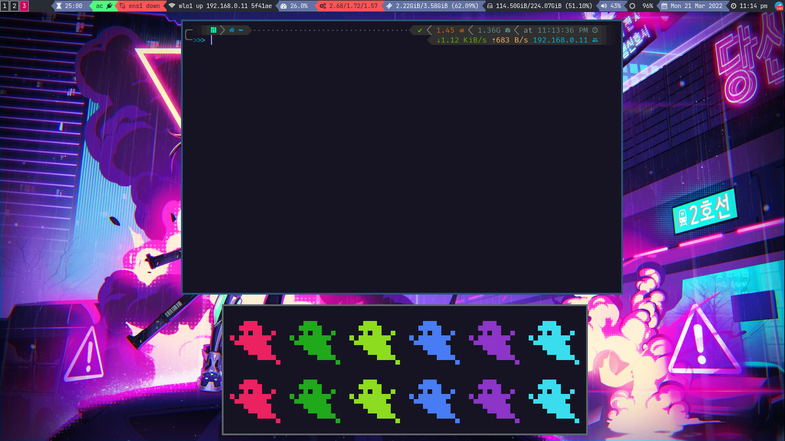

### ⚜️ ️My Arch Linux/Manjaro config dotfiles with i3 + Neovim + Zsh + Rofi + Neofetch ⚜️

------
### Welcome to my dotfiles, Sir.

**For the Shell:**

| Package                                                  | Description                                                      |
|----------------------------------------------------------|------------------------------------------------------------------|
| [Arch Linux](https://www.archlinux.org/)                 | The best distro ever!                                            |
| [Manjaro](https://manjaro.org/)                          | My second love!                                                  |
| [Zsh](https://github.com/zsh-users/zsh)                  | The most powerful shell out there!                               |
| [Powerlevel10k](https://github.com/romkatv/powerlevel10k)| The most awesome Powerline theme for ZSH around!                 |
| [Colorls](https://github.com/athityakumar/colorls#installation)| Use this to set the colorls command configured in zsh alias|
| [neofetch](https://github.com/dylanaraps/neofetch)       | A fast, highly customizable system ifo script                    |
| [Nerd Fonts](https://github.com/ryanoasis/nerd-fonts)    | Fonts patched with lots of amazing icons (I use Source Code Pro) |

------

**For the window manager:**

| Package                                                                   | Description                                                                       |
|---------------------------------------------------------------------------|-----------------------------------------------------------------------------------|
| [i3-gaps](https://github.com/Airblader/i3)                                | i3wm with more features                                                           |
| [i3blocks](https://github.com/vivien/i3blocks)                            | A replacement for the default i3status with more features                         |
| [Nerd Fonts](https://github.com/ryanoasis/nerd-fonts)                     | Fonts patched with lots of amazing icons (I use Source Code Pro)                  |
| [Rofi](https://github.com/DaveDavenport/rofi)                             | A window switcher, application launcher and dmenu replacement                     |
| [Playerctl](https://github.com/acrisci/playerctl)                         | To display current song on i3blocks                                               |
| brightnessctl |                    To modify the bright in the i3 bar | 

| kitty |                   |        New terminal |
| [Feh](https://github.com/derf/feh)                                        | Image viewer, useful to set a wallpaper                                           |
| xfce4-power-manager                                                       | Simple way to monitor battery status                                              |
| xfce4-notifyd                                                             | Helpful to get GTK notifications like current song or battery status              |
| [pacman-contrib](https://www.archlinux.org/packages/?name=pacman-contrib) | Contributed scripts and tools for pacman systems                                  |

------

